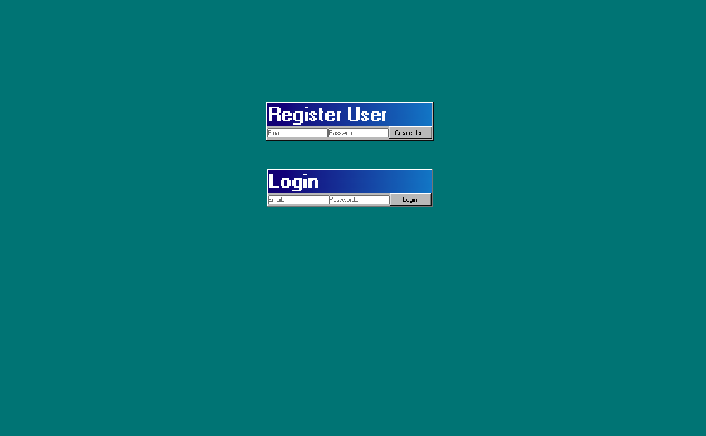
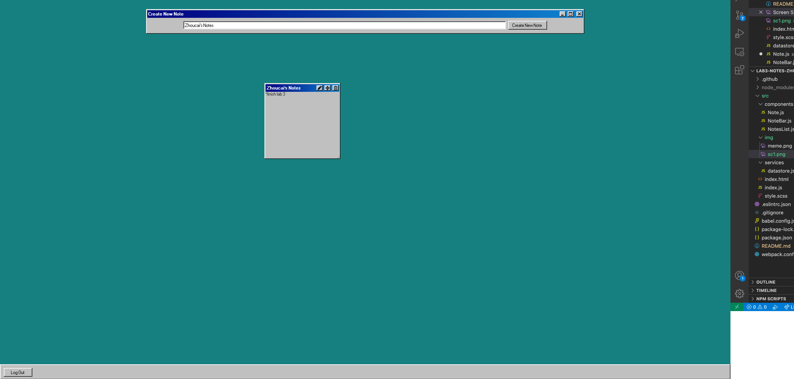

# CS 52 Lab 3 React Notes

*Windows 98 Style Notes App *

[deployed url](https://notes-k96n.onrender.com/)

## What Worked Well

Struggled initially with managing state but got pretty comfortable with it after the first day. After getting throught the basics of managing states, making functions and calling function, I now have a better ideas of how react worked. 

## What Didn't

Have this console error that pops up and says my path to the firebase database is invalid when I try to make a new note. However the data writes fine to the datebase despite this error. Notes are updated and removed without this error.

## Extra Credit

1. The height and the width of the notes are also recorded and can updated in live time.
2. CSS (windows 98 themed)
3. Authentication 

## Screenshots

